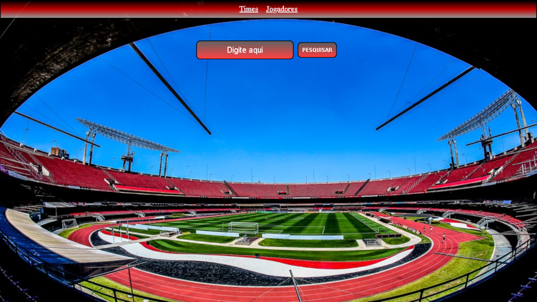

# API-times

* Criei um site de busca de times e jogadores do mundo 
* Fiz uma requisição de api do site https://www.thesportsdb.com/api.php?ref=apilist.fun
* Site responsivo com Media Queries
* Foi usado apenas HTML, CSS e Java Script puro
* Link do site https://dulipe.github.io/API-times/

## indice

* O site tem duas paginas, Uma para pesquisa de times e outra para pesquisa de jogadores
* No menu você tem acesso as duas paginas
* digite o nome do time ou jogador que busca, e clique em pesquisar
* clique em um time ou jogador especifico para ter informações mais detalhadas
